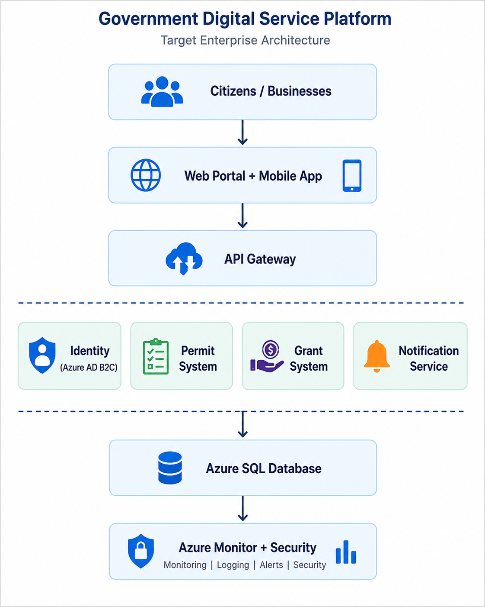

# 🏢 Government Digital Service Platform - Enterprise Architecture Repository

This GitHub repository demonstrates a complete **Enterprise Architecture (EA) reference model** for a fictional **Government Digital Service Platform (GDSP)**. It reflects industry best practices based on **TOGAF**, **Archimate**, and **ISO 42010** principles.

---
## ✨ Overview



The GDSP aims to unify fragmented government services (e.g., Identity - Passport, National ID, Licensing, Registrations, Permits, Grants) into a secure, interoperable, cloud-native architecture for citizens and businesses a like.

---

## 🏛️ 1. Business Architecture

### 1.1 Business Capabilities
- Citizen Identity & Authentication
- Digital Permits and Licenses
- Public Service Grants
- Notifications & Alerts
- Case Management

### 1.2 Value Streams
- Request Permit ➔ Approve ➔ Issue
- Register Citizen ➔ Validate ➔ Enable Access

### 1.3 Stakeholders
| Role             | Responsibility                     |
|------------------|------------------------------------|
| Citizen          | Service consumer                   |
| Case Officer     | Manages applications & workflows   |
| Ministry Admin   | Governance, Reporting              |
| IT Department    | Support, Integration, Security     |

---

## 📈 2. Application Architecture

### 2.1 Application Components
- Citizen Portal (Web + Mobile)
- eID Service
- Permit Management System
- Grant Disbursement Engine
- Notification Microservice
- API Gateway

### 2.2 Interface Inventory
| Source           | Target                 | Interface Type |
|------------------|------------------------|----------------|
| Citizen Portal   | Permit Mgmt System     | REST API       |
| Mobile App       | API Gateway            | GraphQL        |
| Notification Svc | SMS Gateway            | SOAP/XML       |

---

## 🔢 3. Data Architecture

### 3.1 Logical Data Model
- Citizen
- Permit
- Grant
- Application
- Notification

### 3.2 Compliance
- Data classified as **PII**
- Stored in-country per **Data Protection Act**
- Encrypt-at-rest (AES-256), in-transit (TLS 1.3)

---

## 🚀 4. Technology Architecture

### 4.1 Deployment Model
- Cloud: **Azure Government Cloud**
- Compute: **App Services + AKS (Kubernetes)**
- Identity: **Azure AD B2C**
- Database: **Azure SQL**
- API Mgmt: **Azure API Management**
- Messaging: **Azure Service Bus**

### 4.2 Diagram (See: `/docs/architecture-diagram.png`)

---

## 🚪 5. Security Architecture

- RBAC for Portal (Citizen, Case Officer, Admin)
- OAuth2 + OpenID Connect (via Azure AD B2C)
- Logging via Azure Monitor + Log Analytics
- Web Application Firewall (WAF)
- Vulnerability Scans via Defender for Cloud

---

## ✈️ 6. Migration Plan (TOGAF Phases)

| Phase | Deliverable                                |
|-------|--------------------------------------------|
| B     | Current State Architecture                 |
| C     | Target Architecture                        |
| D     | Opportunities & Solutions                  |
| E/F   | Migration & Implementation Governance      |
| G     | Architecture Contract & Compliance Review  |

---

## 🧭 6. Architecture Principles

The platform is designed around the following enterprise principles:

### Business Principles
- Digital-first service delivery
- Citizen-centric experience
- Shared services and reuse

### Data Principles
- Single source of truth
- Privacy by design
- Secure and governed access

### Application Principles
- API-first integration
- Modular and scalable services
- Cloud-native deployment

### Technology Principles
- Security by default
- Infrastructure as Code
- Observability and operational resilience

---

## 📚 7. Repository Structure

```
/gov-digital-service-platform/
├── docs/
│   ├── architecture-diagram.png
│   ├── data-model.drawio
│   ├── capability-map.png
│   └── migration-roadmap.png
├── reference-models/
│   ├── business-architecture.md
│   ├── application-architecture.md
│   ├── data-architecture.md
│   └── technology-architecture.md
├── README.md
└── roadmap.md
```

---

## 🔍 Future Enhancements
- Archimate models (e.g., via Archi)
- CI/CD Pipeline to simulate agile EA delivery
- Add example user stories or business epics

---

## 📊 KPIs for EA Success
- % Reduction in service delivery time
- Citizen NPS (Net Promoter Score)
- % Increase in cross-agency integration

---

## 📅 License
MIT License

---

## ✉️ Contact
Zolile Harvey – Enterprise Architecture | harveyjzo@gmail.com

